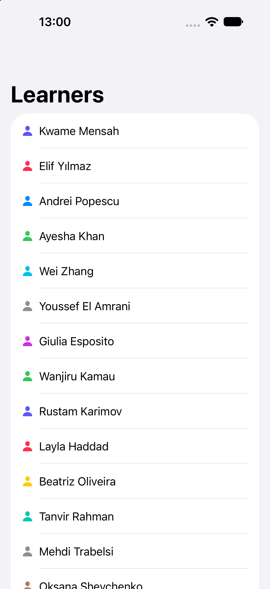

  <h3>Workshop</h3>
  <h1>Creating a list of items in SwiftUI</h1>
   
  <a href="https://github.com/developer-academy-unina/Activity-Template/issues/new?assignees=&labels=bug&template=01_BUG_REPORT.md&title=bug%3A+">Report a Bug</a>
  ·
  <a href="https://github.com/developer-academy-unina/Activity-Template/discussions">Ask a Question</a>
  

   

  
          
  
            

Table of Contents

- [About](#about)
- [Getting Started](#getting-started)
  - [Installation](#installation)
- [Issues and Discussions](#issues-and-discussions)
- [Support](#support)
- [Authors & contributors](#authors--contributors)
- [License](#license)

---

## About

In this workshop you will create a list of items based on a simple data source. Follow along and by the end you can have access to the project created during the workshop by downloading it from the repository.

In this workshop, you will cover:
- How to create an iOS project with Xcode
- How to create interface elements using SwiftUI
- How to run your project on the simulator
- How to preview your project using Xcode Previews
- How to create a list in SwiftUI

### Screenshots

|                               Main View                               |
| :-------------------------------------------------------------------: |
|   |

## Getting Started

### Installation

To get access to the project created during the workshop, you can [download the repository as a zip file](https://github.com/developer-academy-unina/Workshop-Creating-a-list-of-items-in-SwiftUI/archive/refs/heads/main.zip) and access the Learners project in the folder `FinalProject`. The starter project to follow along in the workshop is in the folder `StarterProject`.

## Issues and Discussions

You've found a bug in the source code, a mistake in the documentation or maybe you'd like a new feature? Take a look at [GitHub Discussions](https://github.com/developer-academy-unina/Activity-Template/discussions) to see if it's already being discussed. You can help us by [submitting an issue on GitHub](https://github.com/developer-academy-unina/Workshop-Creating-a-list-of-items-in-SwiftUI/issues). Before you create an issue, make sure to search the issue archive -- your issue may have already been addressed!

Please try to create bug reports that are:

- _Reproducible._ Include steps to reproduce the problem.
- _Specific._ Include as much detail as possible: which version, what environment, etc.
- _Unique._ Do not duplicate existing opened issues.
- _Scoped to a Single Bug._ One bug per report.

## Support

Reach out to the maintainer at one of the following places:

- [GitHub Discussions](https://github.com/developer-academy-unina/Workshop-Creating-a-list-of-items-in-SwiftUI/discussions)
- [GitHub issues](https://github.com/developer-academy-unina/Workshop-Creating-a-list-of-items-in-SwiftUI/issues/new?assignees=&labels=question&template=04_SUPPORT_QUESTION.md&title=support%3A+)
- Contact a Mentor for any other help

## Authors & contributors

The original setup of this repository is by [Jan Armbrust](https://github.com/n0rthk1n9).

For a full list of all authors and contributors, see [the contributors page](https://github.com/developer-academy-unina/Workshop-Creating-a-list-of-items-in-SwiftUI/contributors).

## License

This project is licensed under the **MIT License**.

See [LICENSE](LICENSE) for more information.